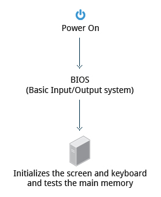

# Introduction to Linux

## Chapter 1: The Linux Foundation
Linux is the world's largest and most pervasive open source software project in history. The Linux Foundation is home to Linux creator Linus Torvalds and lead maintainer Greg Kroah-Hartman, and provides a neutral home where Linux kernel development can be protected and accelerated for years to come.

Three major distribution families:
Red Hat Family Systems (including CentOS and Fedora)
SUSE Family Systems (including openSUSE)
Debian Family Systems (including Ubuntu and Linux Mint).

## Chapter 2: Linux Philosophy and Concepts
 *Whenever you do not understand something or want to know more about a command, program, topic, or utility, you can just type man <topic> at the command line.*

  ### Linux History
  Linux is an open source computer operating system, initially developed on and for Intel x86-based personal computers. It has been subsequently ported to an astoundingly long list of other hardware platforms, from tiny embedded appliances to the world's largest supercomputers.

  Linus Torvalds was a student in Helsinki, Finland, in 1991, when he started a project: writing his own operating system kernel. He also collected together and/or developed the other essential ingredients required to construct an entire operating system with his kernel at the center. It wasn't long before this became known as the Linux kernel.

  In 1992, Linux was re-licensed using the General Public License (GPL) by GNU (a project of the Free Software Foundation or FSF, which promotes freely available software), which made it possible to build a worldwide community of developers. By combining the kernel with other system components from the GNU project, numerous other developers created complete systems called Linux distributions in the mid-90’s.

  Today, Linux powers more than half of the servers on the Internet, the majority of smartphones (via the Android system, which is built on top of Linux), and all of the world’s most powerful supercomputers.

  ### Linux Philosophy
  Linux is constantly enhanced and maintained by a network of developers from all over the world collaborating over the Internet, with Linus Torvalds at the head. Technical skill, a desire to contribute, and the ability to collaborate with others are the only qualifications for participating.

  Linux borrows heavily from the well-established UNIX operating system. It was written to be a free and open source system to be used in place of UNIX, which at the time was designed for computers much more powerful than PCs and was quite expensive. Files are stored in a hierarchical filesystem, with the top node of the system being the root or simply "/". Whenever possible, Linux makes its components available via files or objects that look like files. Processes, devices, and network sockets are all represented by file-like objects, and can often be worked with using the same utilities used for regular files. Linux is a fully multitasking (i.e. multiple threads of execution are performed simultaneously), multiuser operating system, with built-in networking and service processes known as daemons in the UNIX world.

  Note: Linux was inspired by UNIX, but it is not UNIX.

  ### Linux Terminology
  **Kernel**: The brain of the Linux OS. Controls the hardware, and makes it interact with the applications.

  **Distribution**: Also known as Distros. Collection of programs combined with the Linux Kernel to make up a Linux-based Operating System.
  *Debian, Ubuntu, Fedora, CentOS, Red Hat are some examples of distributions.*

  **Boot loader**: Program that boots the operating system.
  *GRUB and ISOLINUX are two examples of bootloaders.*

  **Service**: Program that runs as a background process.
  *Some examples are: httpd, nfsd, ntpd, named*

  **Filesystem**: Method for storing and organizing files.
  *ext3, ext4, FAT, XFS, NTF, Btrfs and HDFS are some examples.*

  **X Window System**: Provides the toolkit and protocol to build graphical user interfaces on nearly all linux systems.

  **Desktop Environment**: Graphical user interface on top of the operating system.
  GNOME, KDE, Xfce, Fluxbox are some examples.

  **Command line**: Interface for typing commands on top of the operating system.

  **Shell**: Command line interpreter that interprets the command line input and instructs the operating system to perform any necessary tasks and commands.
  For example: bash, tcsh, zsh.

  ### Linux Distributions
  The Linux kernel is the core of the operating system. A full Linux distribution consists of the kernel plus a number of other software tools for file-related operations, user management, and software package management. Each of these tools provides a part of the complete system.

  ## Chapter 3: Linux Basics and System Startup
  ### The Boot Process
  

  When the computer is powered on, the **Basic Input/Output System** (BIOS) initializes the hardware, including the screen and keyboard, and tests the main memory. This process is also called POST (Power On Self Test).

  The BIOS software is stored on a ROM chip on the motherboard. After this, the remainder of the boot process is controlled by the operating system (OS).

  

  Once the POST is completed, the system control passes from the BIOS to the **boot loader**. The boot loader is usually stored on one of the hard disks in the system, either in the boot sector (for traditional BIOS/MBR systems) or the EFI partition (for more recent (Unified) Extensible Firmware Interface or EFI/UEFI systems). Up to this stage, the machine does not access any mass storage media. Thereafter, information on date, time, and the most important peripherals are loaded from the CMOS values (after a technology used for the battery-powered memory store which allows the system to keep track of the date and time even when it is powered off).

  A number of boot loaders exist for Linux; the most common ones are GRUB (for GRand Unified Boot loader), ISOLINUX (for booting from removable media), and DAS U-Boot (for booting on embedded devices/appliances). Most Linux boot loaders can present a user interface for choosing alternative options for booting Linux, and even other operating systems that might be installed. When booting Linux, the boot loader is responsible for loading the kernel image and the initial RAM disk or filesystem (which contains some critical files and device drivers needed to start the system) into memory.

  

  *The boot loader has two distinct stages*:

  For systems using the BIOS/MBR method, the boot loader resides at the first sector of the hard disk, also known as the Master Boot Record (MBR). The size of the MBR is just 512 bytes. In this stage, the boot loader examines the partition table and finds a bootable partition. Once it finds a bootable partition, it then searches for the second stage boot loader, for example GRUB, and loads it into RAM (Random Access Memory). For systems using the EFI/UEFI method, UEFI firmware reads its Boot Manager data to determine which UEFI application is to be launched and from where (i.e. from which disk and partition the EFI partition can be found). The firmware then launches the UEFI application, for example GRUB, as defined in the boot entry in the firmware's boot manager. This procedure is more complicated, but more versatile than the older MBR methods.

  The second stage boot loader resides under /boot. A splash screen is displayed, which allows us to choose which operating system (OS) to boot. After choosing the OS, the boot loader loads the kernel of the selected operating system into RAM and passes control to it. The boot loader loads the selected kernel image and passes control to it. Kernels are almost always compressed, so its first job is to uncompress itself. After this, it will check and analyze the system hardware and initialize any hardware device drivers built into the kernel.

  

  The initramfs (**Initial RAM Disk**) filesystem image contains programs and binary files that perform all actions needed to mount the proper root filesystem, like providing kernel functionality for the needed filesystem and device drivers for mass storage controllers with a facility called udev (for user device), which is responsible for figuring out which devices are present, locating the device drivers they need to operate properly, and loading them. After the root filesystem has been found, it is checked for errors and mounted.

  The mount program instructs the operating system that a filesystem is ready for use, and associates it with a particular point in the overall hierarchy of the filesystem (the mount point). If this is successful, the initramfs is cleared from RAM and the init program on the root filesystem (/sbin/init) is executed.

  init handles the mounting and pivoting over to the final real root filesystem. If special hardware drivers are needed before the mass storage can be accessed, they must be in the initramfs image.

  

  Near the end of the boot process, init starts a number of **text-mode login** prompts. These enable you to type your username, followed by your password, and to eventually get a command shell. However, if you are running a system with a graphical login interface, you will not see these at first.

  As you will learn in Chapter 7: Command Line Operations, the terminals which run the command shells can be accessed using the ALT key plus a function key. Most distributions start six text terminals and one graphics terminal starting with F1 or F2. Within a graphical environment, switching to a text console requires pressing CTRL-ALT + the appropriate function key (with F7 or F1 leading to the GUI).

  Usually, the default command shell is bash (the GNU Bourne Again Shell), but there are a number of other advanced command shells available. The shell prints a text prompt, indicating it is ready to accept commands; after the user types the command and presses Enter, the command is executed, and another prompt is displayed after the command is done.

  

  ### Kernel, init and Services
  ### Linux Filesystem Basics
  ### Linux Distribution Installation

  ## Chapter 4: Graphical Interface
  ### Graphical Desktop
  ### Session Management
  ### Basic Operations

  ## Chapter 5: System Configuration from the Graphical Interface
  System, Display, Date and Time Settings
  Network Manager
  Installing and Updating Software

  Chapter 6: Common Applications
  Internet Applications
  Productivity and Development Applications
  Multimedia Applications
  Graphics Editors and Utilities

  Chapter 7: Command Line Operations
  Command-Line Mode Options
  Basic Operations
  Working with Files
  Searching for Files
  Installing Software

  Chapter 8: Finding Linux Documentation
  Documentation Sources
  The man pages
  GNU Info
  The --help Option and help Command
  Other Documentation Sources

  Chapter 9: Processes
  Introduction to Processes and Process Attributes
  Process Metrics and Process Control
  Listing Processes: ps and top
  Starting Processes in the Future

  Chapter 10: File Operations
  Filesystems
  Filesystem Architecture
  Comparing Files and File Types
  Backing Up and Compressing Data

  Chapter 11: Text Editors
  Basic Editors: nano and gedit
  More Advanced Editors: vi and emacs

  Chapter 12: User Environment
  Accounts, Users and Groups
  Environment Variables
  Recalling Previous Commands
  File Permissions

   Chapter 13 : Manipulating Text
  cat and echo
  Working with Large and Compressed Files
  sed and awk
  File Manipulation Utilities
  grep and strings
  Miscellaneous Text Utilities

  Chapter 14: Network Operations
  Network Addresses and DNS
  Networking Configuration and Tools
  Browsers, wget and curl
  Transferring Files

  Chapter 15 : The Bash Shell and Basic Scripting
  Features and Capabilities
  Syntax
  Constructs

  Chapter 16: More on Bash Shell Scripting
  String Manipulation
  The case Statement
  Looping Constructs
  Script Debugging
  Some Additional Useful Techniques
  Challenge Assignment from the Mooqita Project (Optional)

  Chapter 17: Printing
  Configuration
  Printing Operations
  Manipulating Postscript and PDF Files

  Chapter 18: Local Security Principles
  Understanding Linux Security
  When Are root Privileges Required?
  sudo, Process Isolation, Limiting Hardware Access and Keeping Systems Current
  Working with passwords
  Securing the Boot Process and Hardware Resources

  Final Exam
